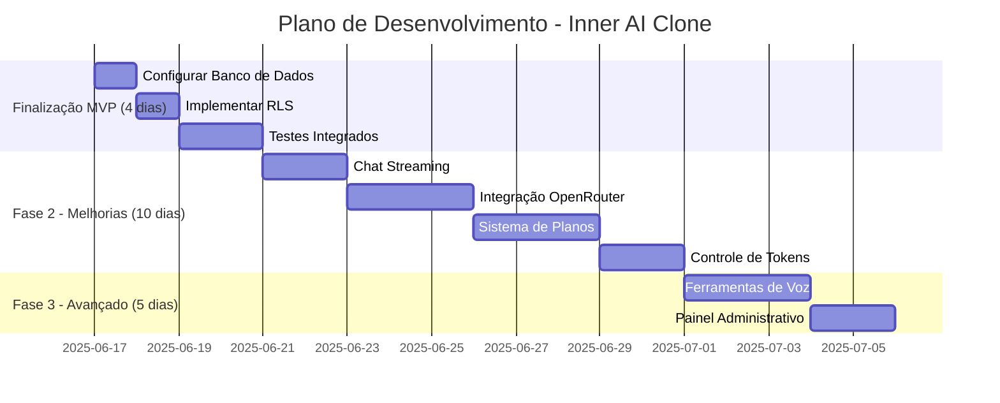

# Plano de Desenvolvimento - Inner AI Clone

## Estado Atual (17/06/2025)
- **MVP Completo** (setup, autenticação, chat básico)
- **Pendências Críticas**:
  - Configuração do banco de dados (DATABASE_URL sem senha)
  - Chave da OpenAI não configurada
  - Tabelas do Prisma não criadas
  - RLS (Row Level Security) não implementado
- **Progresso Geral**: ~40% do projeto

## Roadmap Estratégico



## Detalhamento das Etapas

### 1. Finalização do MVP (17-20/06)
- **Configurar Banco de Dados**:
  - Completar `.env.local` com DATABASE_URL e OPENAI_API_KEY
  - Executar migrações:
    ```bash
    npx prisma db push
    npx prisma generate
    ```
- **Implementar RLS**:
  - Configurar políticas de segurança no Supabase
  - Testar permissões por nível de usuário
- **Testes Integrados**:
  - Fluxo completo de autenticação
  - Geração e salvamento de conversas
  - Controle de limites de uso

### 2. Fase 2 - Melhorias Fundamentais (21-30/06)
- **Chat Streaming**:
  - Implementar resposta em tempo real
  - Indicadores de digitação
  - Cancelamento de requisições
- **OpenRouter Integration**:
  - Suporte a modelos Claude, Llama e Mistral
  - Fallback automático entre providers
- **Sistema de Planos**:
  - Limites de tokens (Free: 1k/dia, Pro: 100k/mês)
  - Restrição de modelos por plano
  - Dashboard de consumo

### 3. Fase 3 - Funcionalidades Avançadas (01-05/07)
- **Ferramentas de Voz**:
  - Integração ElevenLabs/OpenAI TTS
  - Transcrição de áudio
  - Geração de podcasts
- **Painel Administrativo**:
  - Gestão de usuários
  - Monitoramento de uso
  - Configuração de modelos

## Próximos Passos Imediatos
1. Completar configuração do banco no `.env.local`
2. Executar `prisma db push`
3. Implementar políticas de RLS
4. Adicionar streaming ao endpoint `/api/chat/stream`