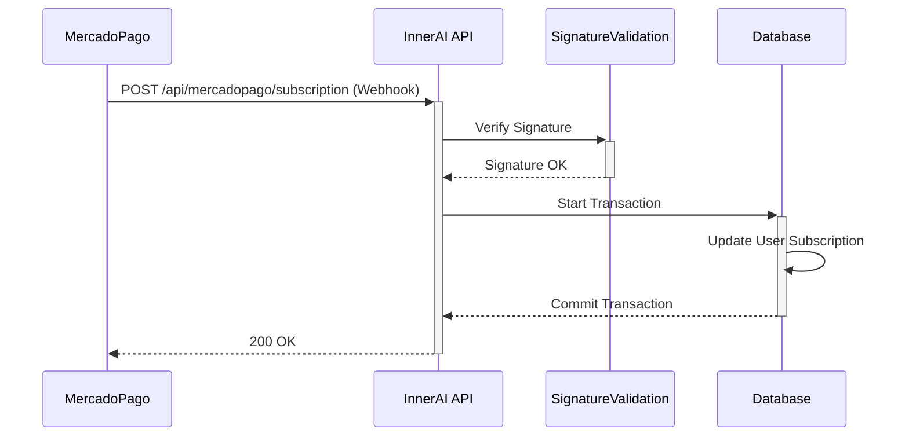

# InnerAI Architecture Document: MercadoPago Webhook Reliability

## 1. Introduction

This document outlines the technical architecture for the MercadoPago Webhook Reliability feature for the InnerAI project. It is based on the requirements defined in the corresponding Product Requirement Document (`docs/prd-mercadopago-fix.md`) and serves as the blueprint for implementation.

### 1.1. Starter Template or Existing Project

This feature will be implemented within the existing InnerAI Next.js application. No new starter templates are required.

### 1.2. Change Log

| Date | Version | Description | Author |
| :--- | :------ | :---------- | :----- |
| 2025-07-04 | 1.0 | Initial draft | @architect |

## 2. High-Level Architecture

### 2.1. Technical Summary

The architecture consists of a single, secure Next.js API route (`/api/mercadopago/subscription`) designed to handle incoming webhooks from MercadoPago. The route will be responsible for validating the request's authenticity, parsing the payload, and executing a transactional database update via Prisma to reflect the user's subscription status. The design prioritizes reliability, security, and detailed logging for traceability.

### 2.2. High-Level Project Diagram

A sequence diagram is the most effective way to visualize the workflow:

### 2.3. Architectural and Design Patterns

- **API Endpoint Pattern:** A standard Next.js API Route will be used to expose the webhook handler.
- **Middleware Pattern (for validation):** The signature validation logic will be encapsulated in a dedicated function that acts as a middleware, processing the request before the core business logic.
- **Transactional Outbox (Consideration):** While not required for the MVP, for future enhancements, we could consider an outbox pattern to decouple webhook receipt from processing for even greater resilience. For now, a direct transactional update is sufficient.
- **Structured Logging:** All logs will be in JSON format to facilitate easier parsing and analysis by monitoring tools.

## 3. Tech Stack

The technology stack is inherited from the existing InnerAI project as defined in the PRD.

| Category | Technology | Version | Purpose |
| :--- | :--- | :--- | :--- |
| **Language** | TypeScript | ~5.x | Primary development language |
| **Framework** | Next.js | ~14.x | Full-stack application framework |
| **Database** | PostgreSQL | ~16.x | Relational database |
| **ORM** | Prisma | ~5.x | Database access and migrations |
| **Logging** | pino (or similar) | latest | Structured, high-performance logging |

## 4. Components

### 4.1. `mercadopago/subscription/route.ts`

- **Responsibility:** The primary component. It orchestrates the entire webhook handling process.
- **Key Interfaces:** Exposes a `POST` handler function.
- **Dependencies:** `lib/mercadopago-validation.ts`, `lib/subscription-service.ts`.
- **Technology Stack:** Next.js, TypeScript.

### 4.2. `lib/mercadopago-validation.ts`

- **Responsibility:** Encapsulates the logic for validating the `x-signature` header from MercadoPago webhooks.
- **Key Interfaces:** Exposes a function `isValidMercadoPagoRequest(request: NextRequest): boolean`.
- **Dependencies:** None.
- **Technology Stack:** TypeScript.

### 4.3. `lib/subscription-service.ts`

- **Responsibility:** Contains the business logic for updating a user's subscription status in the database.
- **Key Interfaces:** Exposes a function `updateSubscriptionFromWebhook(payload: object): Promise<void>`.
- **Dependencies:** Prisma Client.
- **Technology Stack:** TypeScript, Prisma.

## 5. Database Schema

No changes to the database schema are required. This feature will update existing tables. The primary model to be updated is likely `User` or a dedicated `Subscription` model, modifying fields such as:

- `subscriptionStatus`: (e.g., `string` or `enum`)
- `subscriptionEndDate`: `DateTime`
- `mercadopagoSubscriptionId`: `string`

The `updateSubscriptionFromWebhook` service will use `prisma.$transaction` to ensure that any updates related to a single webhook event are atomic.

## 6. Error Handling Strategy

- **Validation Errors:** Invalid signatures will result in a `403 Forbidden` response and a security warning log.
- **Processing Errors:** Any error during payload parsing or database updates will be caught in a `try...catch` block.
- **Logging:** The caught error will be logged in detail (including the request body and headers for debugging).
- **Response:** A generic `500 Internal Server Error` will be returned to MercadoPago, signaling them to retry the webhook later.
- **Idempotency:** The logic should check the user's current subscription status before updating to prevent issues from duplicate webhooks. For example, if a webhook for an "approved" payment arrives but the user's subscription is already active and has a future end date, the event can be logged and safely ignored.

## 7. Security

- **Secrets Management:** The `MERCADOPAGO_WEBHOOK_SECRET` will be stored as an environment variable and accessed via `process.env`. It must never be hardcoded.
- **Input Validation:** The raw request body is required for signature validation and must be handled correctly by Next.js. The parsed JSON payload should also be validated (e.g., using Zod) to ensure it matches the expected structure before processing.

## 8. Next Steps

### Developer Handoff

@dev Please proceed with the implementation based on this architecture document and the stories defined in the PRD (`docs/prd-mercadopago-fix.md`).

- **Start with Story 1.1:** Create the secure webhook endpoint and implement the signature validation logic.
- **Follow with Story 1.2:** Implement the subscription update logic using a Prisma transaction.
- **Finish with Story 1.3:** Ensure robust, structured logging is in place for the entire flow.

Adherence to the defined components and patterns is required.
